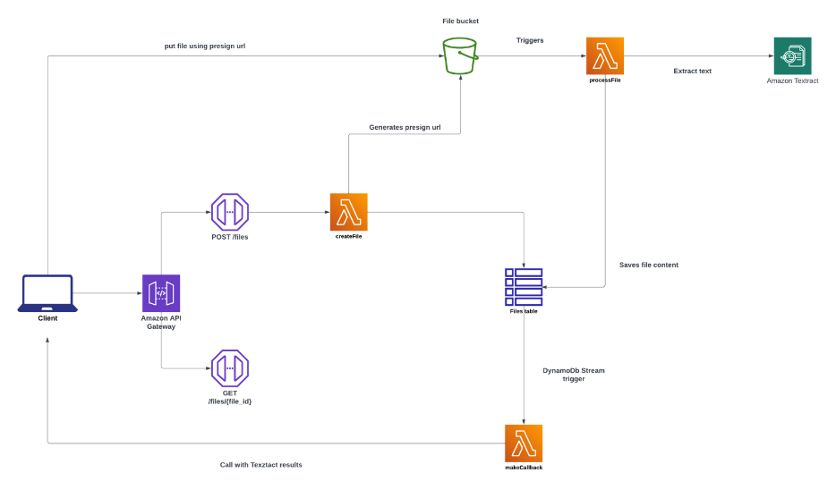

# AWS Serverless FastAPI Textract Table of Contents

- [Introduction](#introduction)
- [Installation](#installation)

<a id="introduction"></a>
## Introduction
This project demonstrates a serverless application on AWS for processing documents using Serverless framework, FastAPI and AWS. It allows users to upload documents to an S3 bucket, which triggers an AWS Lambda function to analyze the documents using Textract. The extracted data is then stored in DynamoDB. 


<a id="installation"></a>
## Installation with Docker
1. Clone This Project: ```git clone https://github.com/serhiikravets/AWS-Serverless-FastAPI-Textract.git```
2. cd to project directory: ```cd AWS-Serverless-FastAPI-Textract```
3. Create virtual env: ```virtualenv --python C:\Path\To\Python\python.exe venv``` or ```python3 -m venv venv```
4. Activate virtual env: ```venv\Scripts\activate``` or ```source venv/bin/activate```
5. Then install requirements: ```pip install -r requirements.txt```
 When you deploy fastapi to AWS, sometimes the errors may occur with pydantic core, so I suggest running this pip install where platform is your desired architechture, this architechture needs to match architechture in your lambda, so you can use arm64 architecthure (Replace manylinux2014_x86_64 with manylinux2014_arm64), but make sure to also define this architechture in serverless.yml under provider section ```pip install -r requirements.txt --only-binary=:all: --upgrade --platform manylinux2014_x86_64 --implementation cp --python-version 3.9 --target venv/Lib/site-packages``` make sure to change target path if your environment path is different
6. If you don't have Node.js installed, you'll need to install it first (you'll need to do this yourself). After that, you can install the Serverless Framework if you haven't already by running the following command: ```npm install -g serverless```
7. Install serverless-python-requirements: ```npm install serverless-python-requirements```
8. Configure AWS credentials using the AWS CLI: ```aws configure```
9. Deploy!: ```serverless deploy```

If you have any questions or need assistance with deployment, feel free to contact me:
- LinkedIn: [Serhii Kravets](https://www.linkedin.com/in/serhii-kravets-74404b240/)
- Email: sergeykravets42@gmail.com
